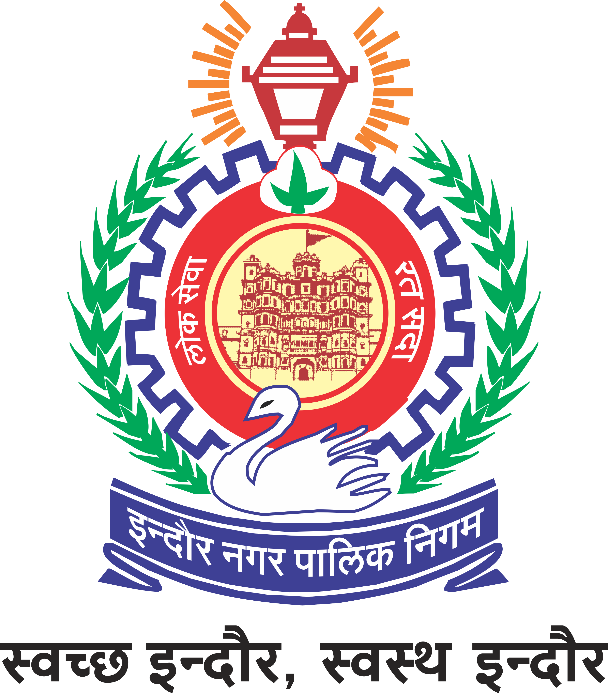
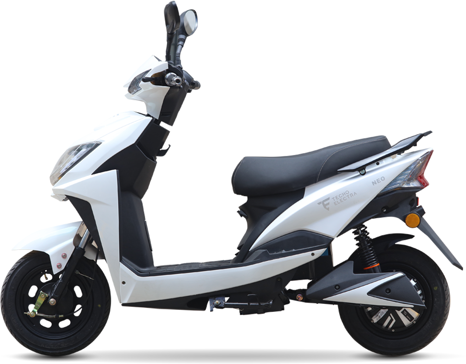

# 🏆 IMC Lucky Draw 2025
## Indore Municipal Corporation - Tax Payer Lucky Draw System

<div align="center">



**🎉 बधाई हो सभी विजेताओं को! 🎉**  
**Congratulations to all the winners of IMC Lucky Draw 2025**

[](https://imc-lucky-draw.vercel.app)
[](https://imc-lucky-draw.vercel.app)

</div>

---

## 📋 Table of Contents

- [🎯 About the Project](#-about-the-project)
- [🏆 Prize Structure](#-prize-structure)
- [✨ Features](#-features)
- [🛠️ Technology Stack](#️-technology-stack)
- [📋 Prerequisites](#-prerequisites)
- [🚀 Installation & Setup](#-installation--setup)
- [📱 Usage](#-usage)
- [🏗️ Project Structure](#️-project-structure)
- [🎯 API Endpoints](#-api-endpoints)
- [🔧 Environment Configuration](#-environment-configuration)
- [📊 Database Schema](#-database-schema)
- [🚀 Deployment](#-deployment)
- [🤝 Contributing](#-contributing)
- [📄 License](#-license)

---

## 🎯 About the Project

The **IMC Lucky Draw 2025** is a digital lottery management system developed for the **Indore Municipal Corporation** to reward property and water tax payers. This system provides a transparent, fair, and automated way to conduct lucky draws for tax-paying citizens of Indore.

### 🌟 Why This System?

- **Encourage Tax Payment**: Incentivize citizens to pay their taxes on time
- **Transparency**: Fair and transparent digital lottery system
- **Government Certified**: Official IMC endorsed lottery results
- **Dual Category**: Separate draws for Property Tax and Water Tax payers

---

## 🏆 Prize Structure

### 🏠 Property Tax Payers

<div align="center">

| Position | Prize | Winners | Image |
|----------|-------|---------|-------|
| **🥇 1st Place** | **Car** | 1 Winner |  |
| **🥈 2nd Place** | **Activa/Scooty** | 3 Winners |  |
| **🥉 3rd Place** | **TV** | 5 Winners |  |
| **🏘️ Zone Winners** | **Mixer** | 5 per Zone |  |

</div>

### 💧 Water Tax Payers

<div align="center">

| Position | Prize | Winners | Image |
|----------|-------|---------|-------|
| **🥇 1st Place** | **Car** | 1 Winner |  |
| **🥈 2nd Place** | **Activa/Scooty** | 3 Winners |  |
| **🥉 3rd Place** | **TV** | 5 Winners |  |
| **🏘️ Zone Winners** | **Mixer** | 5 per Zone |  |

</div>

### 🏆 Additional Benefits
- **Government Certificate** for all winners
- **Digital Winner Cards** with official validation
- **Excel Export** of all winner data for record keeping

---

## ✨ Features

### 🎯 Core Features
- **🎲 Digital Lucky Draw**: Automated, fair lottery system
- **👥 Dual Category Support**: Property & Water tax payers
- **🏆 Multiple Prize Tiers**: 1st, 2nd, 3rd positions + Zone winners
- **🎫 Winner Management**: Digital winner cards and certificates
- **📊 Real-time Results**: Live winner announcement system
- **📱 Responsive Design**: Works on all devices

### 🔧 Administrative Features
- **🔐 Secure Admin Panel**: Protected login system
- **🎰 Digital Tumbler Animation**: Engaging winner selection process
- **📈 Winner Dashboard**: Comprehensive winner management
- **📋 Excel Export**: Download winner data in Excel format
- **🏘️ Zone-wise Drawing**: Separate draws for different zones
- **🔄 Anti-duplicate System**: Ensures no repeated winners

### 🌐 User Experience
- **🎨 Modern UI/UX**: Clean, intuitive interface
- **🌍 Multilingual Support**: Hindi & English
- **⚡ Fast Performance**: Optimized for speed
- **📱 Mobile Responsive**: Perfect on all screen sizes
- **🎬 Animated Transitions**: Smooth, engaging animations

---

## 🛠️ Technology Stack

### Frontend
- **⚛️ Next.js 15.2.2** - React framework with Turbopack
- **🎨 Tailwind CSS** - Utility-first CSS framework
- **🧩 Shadcn/UI** - Reusable UI components
- **📱 Material-UI** - React component library
- **🎬 Lottie React** - Animations
- **🔔 React Hot Toast** - Notifications

### Backend
- **🟢 Node.js** - JavaScript runtime
- **🚀 Express.js** - Web application framework
- **🍃 MongoDB** - NoSQL database
- **🔗 Mongoose** - MongoDB object modeling
- **🔑 JWT** - JSON Web Tokens for authentication
- **📊 ExcelJS** - Excel file generation

### Development Tools
- **📝 ESLint** - Code linting
- **🎯 TypeScript** - Type safety
- **🔄 Git** - Version control

### Deployment
- **▲ Vercel** - Frontend deployment
- **🎭 Render** - Backend deployment
- **☁️ MongoDB Atlas** - Cloud database

---

## 📋 Prerequisites

Before you begin, ensure you have the following installed:

- **Node.js** (version 18.0 or higher)
- **npm** or **yarn** package manager
- **Git** for version control
- **MongoDB** (local installation or MongoDB Atlas account)

---

## 🚀 Installation & Setup

### 1️⃣ Clone the Repository

```bash
git clone https://github.com/VinayLodhi1712/IMC-Lucky-Draw.git
cd IMC-Lucky-Draw
```

### 2️⃣ Install Dependencies

#### Frontend Dependencies
```bash
npm install
```

#### Backend Dependencies
```bash
cd backend
npm install
cd ..
```

### 3️⃣ Environment Configuration

#### Frontend Environment (`.env`)
```env
# API Configuration
NEXT_PUBLIC_API_URL="http://localhost:5000"

# Database and Auth
MONGO_URI=your_mongodb_connection_string
SECRET="your_jwt_secret"
```

#### Backend Environment (`backend/.env`)
```env
MONGO_URI=your_mongodb_connection_string
SECRET="your_jwt_secret"
NEXT_PUBLIC_API_URL="http://localhost:5000"
```

### 4️⃣ Start the Application

#### Start Backend Server
```bash
cd backend
node api.js
# Backend runs on http://localhost:5000
```

#### Start Frontend (New Terminal)
```bash
npm run dev
# Frontend runs on http://localhost:3000
```

### 5️⃣ Access the Application

- **🌐 Frontend**: http://localhost:3000
- **🔧 Backend API**: http://localhost:5000
- **👤 Admin Login**: http://localhost:3000/login

---

## 📱 Usage

### 🏠 Home Page
- View the main lucky draw interface
- See prize information and categories
- Access winner results

### 🔐 Admin Login
- Navigate to `/login`
- Enter admin credentials
- Access protected admin features

### 🎯 Conducting Lucky Draws

#### Property Tax Draws
1. Go to `/property` page
2. Click on desired position (1st, 2nd, 3rd)
3. Watch the digital tumbler animation
4. View selected winners

#### Water Tax Draws
1. Go to `/water` page
2. Select winner category
3. Enjoy the animated selection process
4. Review winner details

#### Zone-wise Draws
1. Navigate to zone selection
2. Choose specific zone number
3. Generate 5 winners per zone
4. Download results

### 📊 Winner Management
- View all winners on `/winners` page
- Download Excel reports
- Generate winner certificates
- Manage winner data

---

## 🏗️ Project Structure

```
IMC-Lucky-Draw/
├── 📁 app/                          # Next.js app directory
│   ├── 📁 _components/              # Reusable React components
│   │   ├── 📄 Navbar.jsx           # Navigation component
│   │   └── 📁 winners/             # Winner-related components
│   │       ├── 📄 DashboardView.jsx    # Winner dashboard
│   │       ├── 📄 DigitalTumbler.jsx   # Lottery animation
│   │       ├── 📄 WinnerCard.jsx       # Winner display card
│   │       ├── 📄 WinnerPosition.jsx   # Position selector
│   │       ├── 📄 WinnerReveal.jsx     # Winner reveal animation
│   │       └── 📄 ZoneInputform.jsx    # Zone selection form
│   ├── 📁 _context/                # React context providers
│   │   ├── 📄 uselanguage.jsx      # Language context
│   │   └── 📄 userAuth.jsx         # Authentication context
│   ├── 📁 _privateRoutes/          # Protected route components
│   │   └── 📄 checkLogin.jsx       # Login verification
│   ├── 📁 hooks/                   # Custom React hooks
│   │   └── 📄 use-window-size.js   # Window size hook
│   ├── 📁 login/                   # Login page
│   │   └── 📄 page.jsx             # Login component
│   ├── 📁 property/                # Property tax section
│   │   └── 📄 page.jsx             # Property draw page
│   ├── 📁 water/                   # Water tax section
│   │   └── 📄 page.jsx             # Water draw page
│   ├── 📁 winners/                 # Winners display
│   │   └── 📄 page.jsx             # Winners listing page
│   ├── 📄 favicon.ico              # App favicon
│   ├── 📄 globals.css              # Global styles
│   ├── 📄 layout.js                # Root layout component
│   ├── 📄 loading.jsx              # Loading component
│   └── 📄 page.js                  # Home page
├── 📁 backend/                     # Express.js backend
│   ├── 📁 middlewares/             # Express middlewares
│   │   └── 📄 isLoggedin.js        # Authentication middleware
│   ├── 📁 schema/                  # MongoDB schemas
│   │   ├── 📄 propertywinners.js   # Property winners schema
│   │   └── 📄 waterwinners.js      # Water winners schema
│   ├── 📄 .env                     # Backend environment variables
│   ├── 📄 api.js                   # Main Express server
│   ├── 📄 dbconnect2.js            # Database connection
│   └── 📄 package.json             # Backend dependencies
├── 📁 components/                  # Shared UI components
│   └── 📁 ui/                      # Shadcn/UI components
├── 📁 lib/                         # Utility libraries
│   ├── 📄 api.js                   # API utility functions
│   └── 📄 utils.js                 # General utilities
├── 📁 public/                      # Static assets
│   ├── 🖼️ car.png                  # Car prize image
│   ├── 🖼️ imc-logo.svg             # IMC logo
│   ├── 🖼️ imclogo.png              # IMC logo PNG
│   ├── 🖼️ mayor.png                # Mayor image
│   ├── 🖼️ mixer.jpeg               # Mixer prize image
│   ├── 🖼️ scooty.png               # Scooty prize image
│   ├── 🖼️ tv.png                   # TV prize image
│   ├── 🎬 HomeScreenVideo.mp4      # Home screen video
│   └── 📄 loading.json             # Lottie loading animation
├── 📄 .env                         # Frontend environment variables
├── 📄 .env.example                 # Environment template
├── 📄 .env.production              # Production environment
├── 📄 .gitignore                   # Git ignore rules
├── 📄 components.json              # Shadcn/UI configuration
├── 📄 eslint.config.mjs            # ESLint configuration
├── 📄 jsconfig.json                # JavaScript configuration
├── 📄 next.config.mjs              # Next.js configuration
├── 📄 package.json                 # Frontend dependencies
├── 📄 postcss.config.mjs           # PostCSS configuration
├── 📄 README.md                    # This file
├── 📄 DEPLOYMENT.md                # Deployment guide
└── 📄 SETUP.md                     # Setup instructions
```

---

## 🎯 API Endpoints

### 🔐 Authentication
```http
POST /Login                          # Admin login
GET  /userAuth                       # Verify user authentication
```

### 🏠 Property Tax Winners
```http
GET  /property_random-winner_1       # Get 1st position winner (Car)
GET  /property_random-winner_2       # Get 2nd position winners (3 Scooty)
GET  /property_random-winner_3       # Get 3rd position winners (5 TV)
GET  /property_random-zone-winners/:zoneNumber  # Get zone winners (5 Mixer)
```

### 💧 Water Tax Winners
```http
GET  /water_random-winner_1          # Get 1st position winner (Car)
GET  /water_random-winner_2          # Get 2nd position winners (3 Scooty)
GET  /water_random-winner_3          # Get 3rd position winners (5 TV)
GET  /water_random-zone-winners/:zoneNumber     # Get zone winners (5 Mixer)
```

### 📊 Data Management
```http
GET  /getAllPropertyWinners          # Get all property winners
GET  /getAllWaterWinners             # Get all water winners
GET  /GenerateExcel                  # Export property winners to Excel
GET  /GenerateExcelWater             # Export water winners to Excel
```

### ✅ Winner Validation
```http
GET  /checkPropertyWinners/:position         # Check if property winners exist
GET  /checkWaterWinners/:position           # Check if water winners exist
GET  /checkPropertyZoneWinners/:zoneNumber  # Check property zone winners
GET  /checkWaterZoneWinners/:zoneNumber     # Check water zone winners
```

---

## 🔧 Environment Configuration

### 📝 Environment Variables

#### Frontend (`.env`)
```env
# API Configuration
NEXT_PUBLIC_API_URL="http://localhost:5000"     # Backend URL
SECRET="your_jwt_secret_key"                    # JWT secret
```

#### Backend (`backend/.env`)
```env
MONGO_URI="mongodb://localhost:27017/imc_lottery"  # MongoDB connection
SECRET="your_jwt_secret_key"                       # JWT secret
NEXT_PUBLIC_API_URL="http://localhost:5000"        # API URL
```

### 🔄 Switching Between Environments

#### Local Development
```env
NEXT_PUBLIC_API_URL="http://localhost:5000"
```

#### Production/Deployed Backend
```env
NEXT_PUBLIC_API_URL="https://imc-lucky-draw.onrender.com"
```

---

## 📊 Database Schema

### 👥 Users/Authors Collection
```javascript
{
  _id: ObjectId,
  Email: String,
  Password: String
}
```

### 🏠 Property Tax Payers Collection
```javascript
{
  _id: ObjectId,
  PARTNER: String,
  PROPERTY_OWNER_NAME: String,
  WARD: String,
  ZONE: String,
  ASSMENTYEAR: String,
  TAX_AMT: Number,
  SR_NO: String,
  isWinner: Boolean
}
```

### 💧 Water Tax Payers Collection
```javascript
{
  _id: ObjectId,
  CONNECTION: String,
  NAME: String,
  WARD: String,
  ZONE: String,
  ADDRESS: String,
  isWinner: Boolean
}
```

### 🏆 Property Winners Collection
```javascript
{
  _id: ObjectId,
  PARTNER: String,
  PROPERTY_OWNER_NAME: String,
  WARD: String,
  ZONE: String,
  ASSMENTYEAR: String,
  TAX_AMT: Number,
  SR_NO: String,
  POSITION: String  // "1st", "2nd", "3rd", "Zone X"
}
```

### 🏆 Water Winners Collection
```javascript
{
  _id: ObjectId,
  CONNECTION: String,
  NAME: String,
  WARD: String,
  ZONE: String,
  ADDRESS: String,
  POSITION: String  // "1st", "2nd", "3rd", "Zone X"
}
```

---

## 🚀 Deployment

### ▲ Frontend Deployment (Vercel)

1. **Connect to Vercel**
   ```bash
   npm install -g vercel
   vercel
   ```

2. **Set Environment Variables in Vercel Dashboard**
   ```env
   NEXT_PUBLIC_API_URL=https://your-backend-url.com
   SECRET=your_jwt_secret
   ```

3. **Deploy**
   ```bash
   vercel --prod
   ```

### 🎭 Backend Deployment (Render)

1. **Create Render Account**
   - Go to [render.com](https://render.com)
   - Connect your GitHub repository

2. **Configure Build Settings**
   - Build Command: `cd backend && npm install`
   - Start Command: `cd backend && node api.js`

3. **Set Environment Variables**
   ```env
   MONGO_URI=your_mongodb_atlas_connection_string
   SECRET=your_jwt_secret
   ```

### ☁️ Database (MongoDB Atlas)

1. **Create MongoDB Atlas Account**
2. **Create Cluster**
3. **Get Connection String**
4. **Add to Environment Variables**

---

## 🎨 Features in Detail

### 🎰 Digital Tumbler Animation
- Realistic lottery tumbler simulation
- Smooth CSS animations
- Suspenseful winner reveal
- Mobile-responsive design

### 📱 Responsive Design
- Mobile-first approach
- Tablet optimization
- Desktop enhancement
- Cross-browser compatibility

### 🔐 Security Features
- JWT-based authentication
- Protected admin routes
- Input validation
- SQL injection prevention

### 🌍 Internationalization
- Hindi language support
- English language support
- Context-based language switching
- Locale-aware formatting

### 📊 Data Export
- Excel file generation
- Formatted winner reports
- Downloadable certificates
- Print-ready layouts

---

## 🤝 Contributing

We welcome contributions! Here's how you can help:

### 🐛 Reporting Bugs
1. Check existing issues
2. Create detailed bug report
3. Include screenshots/videos
4. Provide reproduction steps

### ✨ Feature Requests
1. Open an issue
2. Describe the feature
3. Explain use case
4. Provide mockups if possible

### 💻 Code Contributions
1. Fork the repository
2. Create feature branch
3. Make your changes
4. Add tests if applicable
5. Submit pull request

### 📝 Development Guidelines
```bash
# Clone your fork
git clone https://github.com/your-username/IMC-Lucky-Draw.git

# Create feature branch
git checkout -b feature/amazing-feature

# Make changes and commit
git commit -m "Add amazing feature"

# Push to your fork
git push origin feature/amazing-feature

# Create pull request
```

---

## 🎯 Future Enhancements

### 🔮 Planned Features
- [ ] **SMS Notifications** for winners
- [ ] **Email Integration** for certificates
- [ ] **QR Code Generation** for verification
- [ ] **Advanced Analytics** dashboard
- [ ] **Multi-city Support** for other municipalities
- [ ] **API Rate Limiting** for better security
- [ ] **Real-time Updates** with WebSockets
- [ ] **Mobile App** for iOS and Android

### 🚀 Performance Improvements
- [ ] **Redis Caching** for better performance
- [ ] **CDN Integration** for faster asset delivery
- [ ] **Database Optimization** and indexing
- [ ] **API Response Caching**

---

## 📞 Support & Contact

### 🏛️ Official IMC Contact
- **Website**: [Indore Municipal Corporation](https://www.imcindore.org)
- **Address**: Indore Municipal Corporation, Indore, Madhya Pradesh

### 👨‍💻 Development Team
- **Developer**: Vinay Lodhi
- **GitHub**: [@VinayLodhi1712](https://github.com/VinayLodhi1712)
- **Repository**: [IMC-Lucky-Draw](https://github.com/VinayLodhi1712/IMC-Lucky-Draw)

### 🆘 Getting Help
1. **Documentation**: Check this README first
2. **Issues**: Create GitHub issue for bugs
3. **Discussions**: Use GitHub Discussions for questions
4. **Email**: Contact IMC for official queries

---

## 📄 License

This project is developed for the **Indore Municipal Corporation** and is intended for official government use. 

### ⚖️ Usage Rights
- ✅ **Government Use**: Authorized for IMC and related government entities
- ✅ **Educational Use**: Can be used for learning and reference
- ❌ **Commercial Use**: Not authorized without proper permissions
- ❌ **Redistribution**: Contact IMC for redistribution rights

### 🛡️ Disclaimer
This system is designed specifically for the Indore Municipal Corporation's tax payer lottery program. Any unauthorized use or modification should be done in compliance with local laws and regulations.

---

## 🙏 Acknowledgments

### 🏛️ Special Thanks
- **Indore Municipal Corporation** for the opportunity
- **Tax Paying Citizens** of Indore for their civic responsibility
- **Development Community** for open-source tools and libraries

### 🛠️ Built With Love Using
- [Next.js](https://nextjs.org/) - The React Framework
- [Node.js](https://nodejs.org/) - JavaScript Runtime
- [MongoDB](https://www.mongodb.com/) - Database
- [Tailwind CSS](https://tailwindcss.com/) - CSS Framework
- [Vercel](https://vercel.com/) - Deployment Platform

---

<div align="center">

### 🎉 **Thank you for using IMC Lucky Draw 2025!** 🎉

**Made with ❤️ for the citizens of Indore**

[](https://github.com/VinayLodhi1712/IMC-Lucky-Draw)
[](https://github.com/VinayLodhi1712/IMC-Lucky-Draw)

**🏆 बधाई हो सभी विजेताओं को! | Congratulations to all winners! 🏆**

</div>
